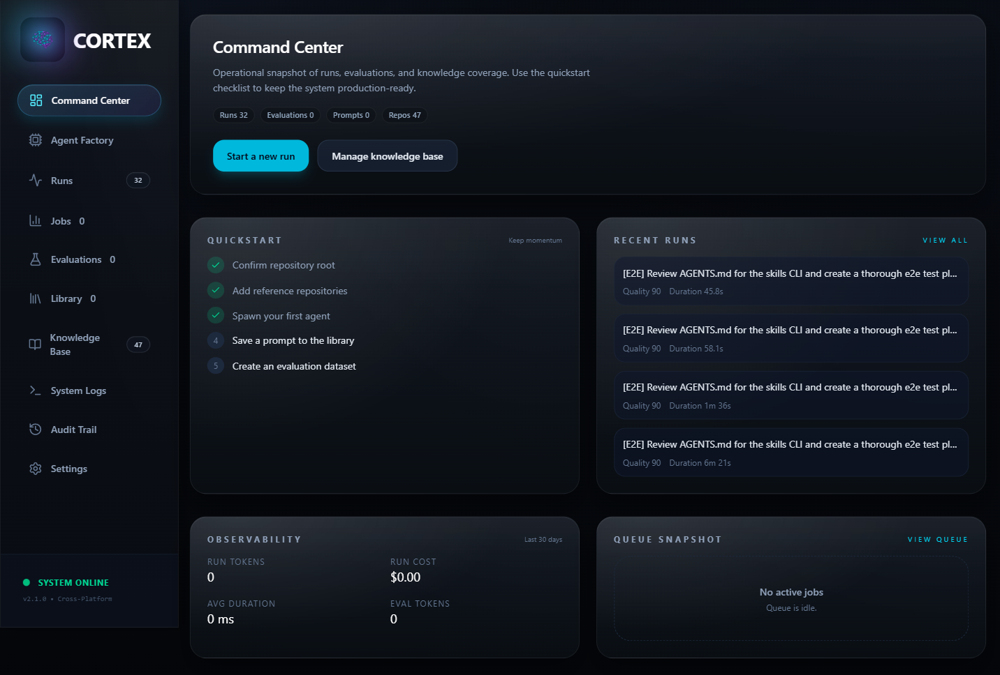
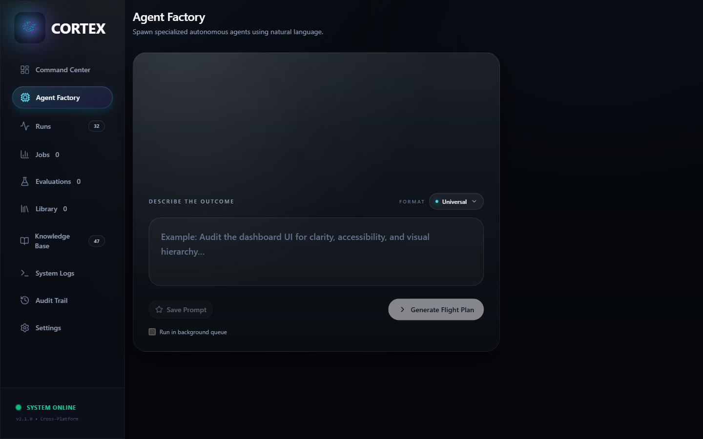
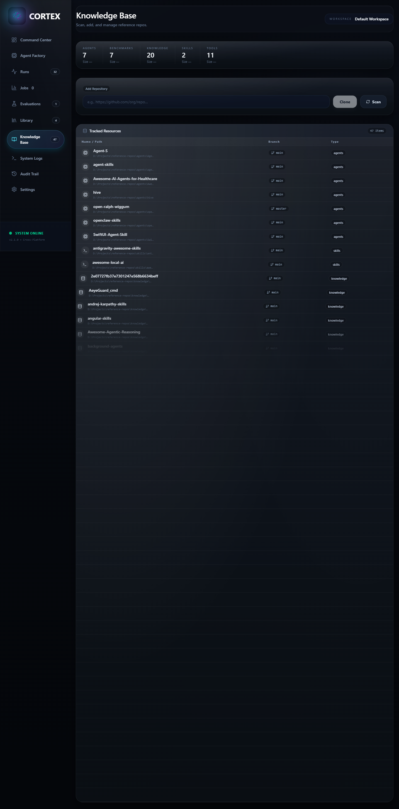
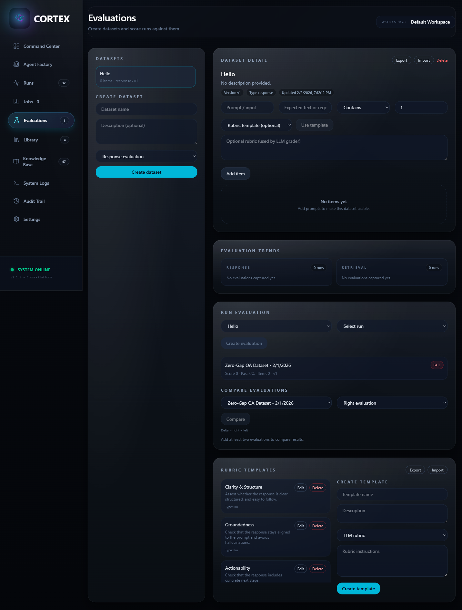
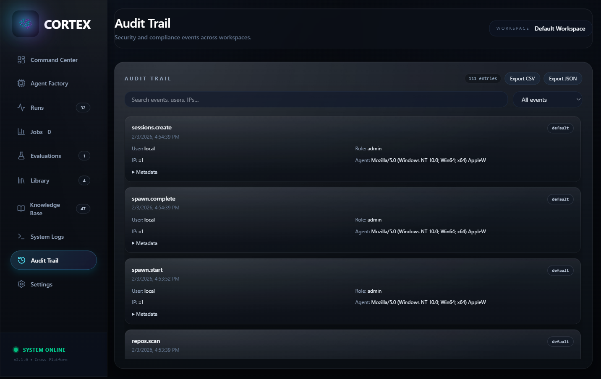

# CORTEX

### **Centralized Orchestration & Repository Training for Expert eXecution**

> **The Model-Agnostic AI Operations Platform for Local-First Teams**

---

## 🎯 What is CORTEX?

**CORTEX** is a self-hosted AI orchestration platform that transforms how development teams leverage Large Language Models (LLMs). Unlike cloud-based AI tools that require uploading your entire codebase to third-party servers, CORTEX keeps your intellectual property local while providing enterprise-grade agent spawning, context management, and knowledge organization.

### The Problem We Solve

Modern AI tools suffer from three critical flaws:
1. **Vendor Lock-In**: Teams become dependent on a single AI provider (OpenAI, Anthropic, Google)
2. **Data Transfer Overhead**: Codebases upload to external servers for indexing and RAG
3. **Context Chaos**: Developers manually copy-paste files into chats, wasting tokens and losing structure

### The CORTEX Solution

We decouple **Data** (your local repositories) from **Intelligence** (the LLM), creating a "Reference-Based RAG" system:

```
┌─────────────────────┐
│   Your Codebase     │  ◄── Stays Local, Never Uploaded
│  (Reference Repos)  │
└──────────┬──────────┘
           │
           ▼
┌─────────────────────┐
│   CORTEX Platform   │  ◄── Scans, Indexes, Generates Plans
│   (Orchestrator)    │
└──────────┬──────────┘
           │
           ▼
   ┌───────────────┐
   │ Flight Plan   │  ◄── Exported Markdown with File Paths
   │  (Markdown)   │
   └───────┬───────┘
           │
           ▼
┌─────────────────────┐
│  Any LLM You Choose │  ◄── GPT-4, Claude, Gemini, Qwen
│   (Execution Layer) │
└─────────────────────┘
```

**Result**: You control the data, choose the model, and maintain an auditable AI workflow—locally or with remote inference as needed.

---

## ✨ Key Features

### 🏭 **Agent Factory**
Spawn specialized AI agents using natural language prompts. CORTEX analyzes your request, scans your local knowledge base, and generates a "Flight Plan"—a pre-configured prompt that tells the execution LLM exactly what files to read and what to do.

**Example**:
- **Your Input**: *"Audit the authentication module for security vulnerabilities"*
- **CORTEX Output**: A specialized Agent Plan referencing your exact auth files, security best practices from your knowledge base, and step-by-step instructions

### 🔒 **Local-First Architecture**
- **Runs Locally by Default**: Everything works on `localhost` out of the box
- **Optional Remote LLMs**: You can connect to a cloud or LAN LLM endpoint when desired
- **Remote Endpoints Disabled by Default**: Explicitly enable remote endpoints in Settings to use non-local LLMs
- **File Path References**: Instead of uploading code, CORTEX generates plans with file paths
- **Flexible Execution**: Copy/paste plans or integrate via API

### 🎨 **Premium Dashboard UI**
Built with React, Tailwind CSS, and Framer Motion, featuring:
- **Glassmorphism Design**: Apple/Google-inspired visual language
- **Real-Time Monitoring**: Watch repository scans and agent spawns in action
- **One-Click Operations**: Spawn agents, manage repos, view logs—all from a beautiful interface

### 📸 **Product Screenshots**







To refresh screenshots: `npm run e2e:edge -- tests/e2e/screenshots.spec.js`

### 📚 **Reference Repository Management**
Organize your AI knowledge base into structured categories:
- **Agents**: Pre-configured agent templates (Agent-S, Standard Agent)
- **Skills**: Reusable procedures (Testing frameworks, API patterns)
- **Knowledge**: Documentation, best practices, research papers
- **Tools**: Utility scripts and automation helpers

### 🧭 **Workspaces & Multi‑Tenant Control**
- Create multiple workspaces with isolated repos and outputs.
- Workspace-scoped analytics, runs, evaluations, and audit trails.
- Admin-only switching for shared installations.

### 🧪 **Evaluation Lab (Rubrics + Retrieval Benchmarks)**
- LLM rubric grading with reusable template library.
- Dataset import/export for repeatable QA.
- Retrieval benchmarks with precision/recall/MRR scoring.

### 🧾 **Audit Trail & Compliance**
- Append‑only audit log with user, workspace, and event metadata.
- SCIM‑style provisioning and header‑based SSO for enterprise IdPs.
- Export audit events as CSV/JSON for compliance reviews.

### 🖥️ **Cross-Platform Support**
CORTEX runs on Windows, macOS, and Linux with zero configuration changes.

### 📊 **Analytics & Session History**
- Track agent spawn history and success rates
- Reuse previous sessions with one click
- View most-used agents and resources
- Audit log written to `audit.log.jsonl` for compliance reviews

### 🧭 **Run Explorer**
- Inspect decision matrices, traces, and quality signals per spawn
- Review run duration, uncertainty, and resource coverage
- Drill into a performance timeline with per‑stage durations
- Surface issues like low-confidence routing or sparse retrieval
- Compare runs side‑by‑side and view git metadata/diff stats
- Track estimated token usage and cost per run

### 🧪 **Evaluation Lab**
- Build datasets of prompts + expected outcomes
  - Per‑item grading with pass/fail thresholds
  - Optional LLM rubric grading with built‑in templates
  - Export/import datasets as JSON for sharing and versioning
  - Versioned datasets with update history
- Score runs against datasets for regression testing
  - Compare run quality metrics over time
  - Trendline snapshots for response vs retrieval benchmarks
  - Manage rubric templates (create, edit, delete, import/export)
  - Capture LLM grading usage and cost estimates

### 📦 **Library & Templates**
- Save and reuse prompts across teams
- Browse agent templates and tool catalog
- Jump from library assets directly into Agent Factory

### 🔐 **Authentication & RBAC**
- Optional local authentication with Viewer/Editor/Admin roles
- Bootstrap-first admin flow to secure initial setup
- Resource-level RBAC policy with per-action permissions

### 🧵 **Background Job Queue**
- Queue spawns and index rebuilds for long-running tasks
- Monitor status, cancel jobs, and view outputs

### 🧠 **Semantic Vector Index**
- Local TF‑IDF vector index with chunking + overlap
- Hybrid sparse/semantic retrieval support
- Manual rebuild or auto‑rebuild when missing

### 📈 **Observability & Cost Tracking**
- Aggregate run/eval tokens + cost estimates
- Alert thresholds for cost, tokens, and duration

---

## 🏗️ Architecture

```
cortex/
├── client/                  # React + Vite Frontend
│   ├── src/
│   │   ├── App.jsx         # Main UI (Dashboard, Agent Factory, Settings)
│   │   └── index.css       # Tailwind Globals
│   └── package.json
├── server/                  # Node.js + Express Backend
│   ├── index.js            # API Server (Port 3001)
│   ├── orchestrator.js     # Agent Spawning Logic
│   ├── goal-analyzer.js    # Intent + tech stack analysis
│   ├── retrieval-gate.js   # Query classification for retrieval skipping
│   ├── agent-selector.js   # Deterministic agent scoring
│   ├── resource-matcher.js # Resource scoring + filtering
│   ├── llm-reranker.js     # Optional Qwen rerank layer
│   ├── late-interaction-reranker.js # Token-level rerank (ColBERT-style)
│   ├── auth.js             # Auth middleware + token issuance
│   ├── auth-store.js       # Local user store
│   ├── job-queue.js        # Background job queue
│   ├── vector-index.js     # Semantic vector index lifecycle
│   ├── token-estimator.js  # Token + cost estimation helpers
│   ├── observability.js    # Usage summary helpers
│   ├── config.js           # Configuration Management
│   └── repo-manager.js     # Cross-platform Git Operations
├── config.json             # User Configuration (created on first run)
├── runs.json               # Run history (auto-generated)
├── datasets.json           # Evaluation datasets (auto-generated)
├── evaluations.json        # Evaluation results (auto-generated)
├── evaluation_templates.json # Rubric templates (auto-generated)
├── jobs.json               # Background queue (auto-generated)
├── users.json              # Local auth users (auto-generated)
├── vector_index.json       # Semantic index (auto-generated)
└── package.json            # Monorepo Root
```

### Technology Stack
- **Frontend**: React 19, Tailwind CSS 4, Framer Motion, Lucide Icons
- **Backend**: Node.js, Express.js
- **Orchestration**: Custom Reference-RAG engine
- **Deployment**: Self-hosted (Windows/Mac/Linux compatible)

---

## 🚀 Quick Start

### Prerequisites
- **Node.js** 18+ ([Download](https://nodejs.org/))
- **Git** ([Download](https://git-scm.com/))

### Installation

1. **Clone the Repository**
   ```bash
   git clone https://github.com/your-org/cortex.git
   cd cortex
   ```

2. **Install Dependencies**
   ```bash
   npm install
   cd client && npm install && cd ..
   ```

3. **Start CORTEX**
   ```bash
   npm start
   ```

4. **Complete First-Run Setup**
   - Open [http://localhost:5173](http://localhost:5173)
   - The Setup Wizard will guide you through configuring your repository root
   - CORTEX will create the directory structure if needed

5. **Access the Dashboard**
   - Frontend: [http://localhost:5173](http://localhost:5173)
   - Backend API: [http://localhost:3001](http://localhost:3001)

### Configuration Options

CORTEX can be configured via:

1. **Setup Wizard** (First Run) - Graphical interface
2. **Settings Panel** - Change configuration anytime from the UI
3. **Environment Variables** - For CI/CD and Docker:
   ```bash
   REPOS_ROOT=/path/to/reference-repos
   CORTEX_OUTPUT_DIR=/path/to/output
   PORT=3001
   ```
4. **config.json** - Manual editing (see `config.example.json`)
5. **Saved prompts** - Stored in `saved_prompts.json` (separate from config to avoid accidental loss)

---

## 📖 Usage

### Spawning Your First Agent

1. **Navigate to Agent Factory**
   - Open [http://localhost:5173](http://localhost:5173)
   - Click **"Agent Factory"** in the sidebar

2. **Describe Your Objective**
   ```
   "Audit my React components for accessibility issues"
   ```

3. **Watch the Status Timeline**
   - See real-time progress: analyzing keywords, selecting agent, searching resources

4. **Generate Flight Plan**
   - Click the **Send button** (circular icon)
   - CORTEX scans your repos and generates a specialized plan

5. **Execute with Your LLM**
   - Click **"Copy to Clipboard"**
   - Paste into:
     - **This Chat** (if using Gemini with file access)
     - **Claude Desktop** (with your project folder open)
     - **ChatGPT** (via API or web interface)

6. **Agent Executes**
   The LLM reads the referenced files and performs the audit automatically.

### Reusing Previous Sessions

- Previous spawns are saved automatically
- Click any session in the "Recent Sessions" panel to reuse its goal
- View analytics to see which agents and resources are most effective

---

## 🎓 Core Concepts

### Flight Plans
A **Flight Plan** is a Markdown document generated by CORTEX containing:
- **Mission Objective**: What the agent should accomplish
- **Referenced Files**: Exact paths to knowledge/skills/code (with previews)
- **Execution Steps**: Structured instructions

**Why Markdown?**
- Human-readable and auditable
- Works with *any* LLM (no proprietary format)
- Easy to version control

### Reference Repositories
Your `reference-repos` folder structure might look like:
```
~/reference-repos/
├── agents/
│   ├── Agent-S/              # OS-level automation agent
│   └── std-agent/            # General-purpose reasoning agent
├── skills/
│   ├── react-testing/
│   └── api-design/
├── knowledge/
│   ├── security-guidelines/
│   └── performance-optimization/
└── tools/
    └── code-analysis/
```

CORTEX automatically categorizes repos based on their content.

### Decision Matrix (AGENTS‑First)
CORTEX uses a deterministic decision matrix with an LLM-assisted agent router (advisory by default), retrieval gating, query expansion (RAG‑Fusion), hybrid retrieval (sparse + semantic) with RRF fusion, optional HyDE fallback, a late‑interaction rerank, and an optional Qwen2.5 resource rerank layer for low‑confidence/uncertain cases. AGENTS.md instructions are treated as the highest‑priority context and always appear first in required reading.

```mermaid
flowchart TD
    A[User goal] --> B[Goal analysis]
    B --> C[Deterministic agent scoring]
    C --> D{LLM agent router enabled?}
    D -->|Yes| E[LLM agent rerank (advisory/always)]
    D -->|No| F[Keep deterministic agent]
    E --> G{Accept LLM override?}
    G -->|Yes| H[Select LLM-ranked agent]
    G -->|No| F
    F --> I{Retrieval gate}
    I -->|Skip| O[Generate flight plan]
    I -->|Retrieve| J[Query expansion + RAG-Fusion]
    J --> K[Hybrid retrieval (sparse + semantic)]
    K --> L[Deterministic scoring + RRF fusion]
    L --> M{AGENTS.md present?}
    M -->|Yes| N[Inject AGENTS.md as highest priority]
    M -->|No| P[Proceed]
    N --> Q[Routing + uncertainty gates]
    P --> Q
    Q -->|Needs review| R[Require human review]
    Q -->|OK| S[Late-interaction rerank]
    S --> T{LLM resource rerank enabled + uncertainty?}
    T -->|Yes| U[Qwen2.5 rerank top N]
    U --> V{Rerank valid?}
    V -->|No| W[Fallback to deterministic]
    V -->|Yes| X[Apply reranked order]
    T -->|No| W
    W --> O
    X --> O
    O --> Y[Output]
```

See `docs/decision-matrix.md` for the full spec and gating rules.

---

## 🛠️ Advanced Configuration

### Environment Variables

| Variable | Description | Default |
|----------|-------------|---------|
| `REPOS_ROOT` | Path to reference repositories | `~/Projects/reference-repos` |
| `CORTEX_OUTPUT_DIR` | Where to save flight plans | `./spawned_agents` |
| `PORT` | Backend API port | `3001` |
| `LLM_ENABLED` | Enable optional reranker | `1` |
| `LLM_ENDPOINT` | OpenAI‑compatible or Ollama endpoint | `http://localhost:8080/v1/chat/completions` |
| `LLM_MODEL` | Local model name | `qwen2.5-14b-instruct-q4` |
| `LLM_MODEL_DIR` | Model directory (Windows default) | `D:\\Models\\qwen2.5-14b-instruct-q4` |

### Custom Agent Templates
Add new agent types by creating `agents/your-agent-name/template.md` in your reference repos.

Optionally add `agent.config.json` for custom keywords:
```json
{
  "name": "Security Agent",
  "description": "Specialized security auditor",
  "keywords": ["security", "audit", "vulnerability", "pentest"]
}
```

---

## 🔧 Troubleshooting

### `npm start` fails
- **Issue**: Port already in use
- **Fix**: Kill existing Node processes:
  ```bash
  # Windows
  taskkill /F /IM node.exe

  # Mac/Linux
  killall node
  ```

### Dashboard shows "No Repositories"
- **Issue**: Repository root not configured or empty
- **Fix**:
  1. Go to Settings and verify the path
  2. Click "Scan System" to discover repositories
  3. Use "Smart Clone" to add repositories

### Agent Factory generates empty plans
- **Issue**: No matching knowledge/skills found
- **Fix**: Add relevant repositories to your reference folder

### Setup Wizard shows "Invalid Path"
- **Issue**: Parent directory doesn't exist or no write permission
- **Fix**: Create the parent directory first, or choose a different location

---

## 📊 Roadmap

- [x] Basic Repository Management
- [x] Agent Factory UI
- [x] Reference-Based RAG
- [x] Flight Plan Generation
- [x] Cross-Platform Support (Windows, macOS, Linux)
- [x] First-Run Setup Wizard
- [x] Settings Panel
- [x] Session History & Analytics
- [x] Agent Status Timeline
- [x] Resource Preview Cards
- [ ] Visual Workflow Builder
- [ ] Multi-Agent Teams
- [ ] Built-in API Integration (OpenAI, Anthropic)
- [ ] Human-in-the-Loop Checkpoints
- [ ] Multi-Repo Knowledge Graphs
- [ ] Cloud Sync (Encrypted)
- [x] Local auth + RBAC + audit logs
- [ ] SSO + enterprise IdP integration

---

## 🏢 Enterprise Use Cases

### 1. **Consultancy Firms**
- Spin up client-specific agents using isolated repos
- Maintain knowledge isolation between projects
- Standardize AI workflows across teams

### 2. **Security Audits**
- Generate reproducible audit agents
- Ensure compliance with data privacy regulations
- Version control your AI prompts

### 3. **Developer Teams**
- Democratize AI: Junior devs get senior-level guidance
- Reduce context switching overhead
- Build institutional knowledge bases

---

## 🤝 Contributing

We welcome contributions!

### Development Setup
```bash
# Install dependencies
npm install
cd client && npm install && cd ..

# Start in development mode
npm start

# Backend runs on port 3001
# Frontend runs on port 5173 with hot reload
```

### Testing
- Automated: `npm run e2e` (Playwright)
- Manual QA: `docs/qa-manual.md` (includes decision‑matrix verification)

---

## 📜 License

MIT License - feel free to use CORTEX commercially.

---

## 🙏 Acknowledgments

- **Agent-S**: [Original Repository](https://github.com/simular-ai/Agent-S)
- **Design Inspiration**: Apple Human Interface Guidelines, Google Material Design 3

---

## 💬 Support

- **Issues**: [GitHub Issues](https://github.com/your-org/cortex/issues)
- **Discussions**: [GitHub Discussions](https://github.com/your-org/cortex/discussions)

---

## 🌟 Star Us on GitHub!

If CORTEX helps your team, please give us a ⭐ on GitHub!

---

**Built with ❤️ for developers who value privacy, flexibility, and control.**
