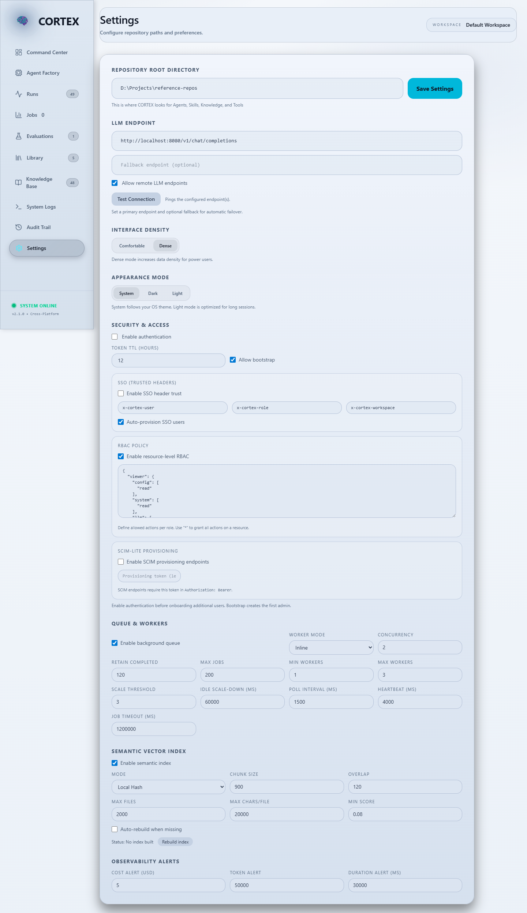

# Local LLM Endpoint Setup

This guide walks through configuring local LLM endpoints for CORTEX. It covers Ollama, LM Studio, and any OpenAI-compatible local server.

## Supported local servers
- Ollama
- LM Studio (OpenAI-compatible server)
- Any OpenAI-compatible local server (v1/chat/completions)

## Step 1: Start a local LLM server

### Ollama
1. Install Ollama from https://ollama.com/.
2. Pull a model you plan to use:
   ```bash
   ollama pull qwen2.5:14b-instruct-q4
   ```
3. Ensure the server is running:
   ```bash
   ollama serve
   ```
4. Default endpoint: `http://localhost:11434/api/chat`

### LM Studio
1. Install LM Studio from https://lmstudio.ai/.
2. Download a model and start the OpenAI-compatible server.
3. Default endpoint: `http://localhost:1234/v1/chat/completions`

### OpenAI-compatible local server
1. Start the server with a chat completions endpoint.
2. Note the endpoint URL (for example: `http://localhost:8080/v1/chat/completions`).

## Step 2: Configure CORTEX
Open Settings and set:
- Provider: `ollama` or `openai-compatible`
- Endpoint: your local URL
- Model: the local model name
- Timeout and token limits as needed

Example `config.json` snippet:
```json
{
  "llm": {
    "enabled": true,
    "provider": "openai-compatible",
    "model": "qwen2.5-14b-instruct-q4",
    "endpoint": "http://localhost:8080/v1/chat/completions",
    "allowRemote": false
  }
}
```

## Step 3: Test the connection
Use **Settings > Test Connection** to validate reachability. If the endpoint is remote, enable remote endpoints first.

## Remote endpoints (optional)
Remote endpoints are disabled by default. To enable them:
- Toggle "Allow remote endpoints" in Settings, or
- Set `LLM_ALLOW_REMOTE=1` in the environment

## Windows local model path
On Windows, the decision matrix assumes local model artifacts live on a dedicated drive (example `C:\Models`). Set `LLM_MODEL_DIR` to that path or update the model directory in Settings.

## Screenshot

